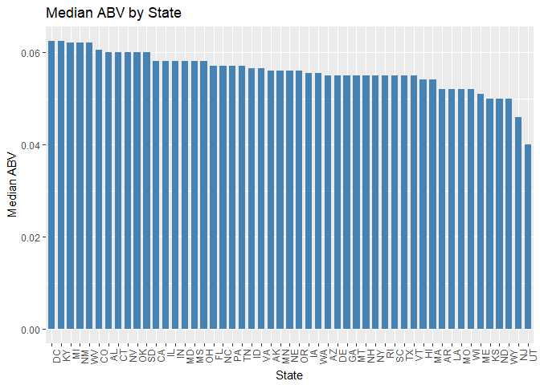

#Introduction
<p>The following analysis has been completed for our client, Dr. Santerre, who is in need of a good strong beer. He has asked our team to complete an analysis based on beer's alcohol content and bitterness level from a list of breweries in the United States. We will show you how we merged and cleaned the datasets provided. Then we will go through a list of questions asked to finally determine which States hold the 'Next GoTo Beers' Dr. Santerre should try.
</p>

<b>Dataset</b>
<p>Two datasets were provided by the client. One file contains a list of all Breweries in the US plus District of Columbia. 
The other file contains a list of Breweries and the craft beers they produce with the ABV, IBV, and Style indication.

<b>Data Merge and Cleaning</b>
<p>The code we created imports the two .csv files, provided by the client, into a program called R. In the R program, these .csv files are merged utilizing the Brewery Id as the common field between the files. 
Merging these files provides a complete list of Breweries and the craft beers they produce with associated attributes from both files. 
A series of steps to clean the data from abnormalities was performed including conversion to data types that reflect the nature of the data, removal of whitespace, search for possible duplicates, and column headings normalized with duplicates removed. A sample of the data is shown below.
</p>


```r
# load Beers.csv, setting data types
classProfile <- c("character", "integer", "numeric", "integer", "integer", "factor", "numeric")
beers <- read.csv("Beers.csv", colClasses = classProfile, na.strings = "", strip.white = TRUE)

# further specify Name column in beers
names(beers)[names(beers) == "Name"] <- "Beer_Name"

# load Breweries.csv, setting data types
classProfile <- c("integer","character", "character", "factor")
breweries <- read.csv("Breweries.csv", colClasses = classProfile, na.strings = "", strip.white = TRUE)

# further specify Name column in breweries
names(breweries)[names(breweries) == "Name"] <- "Brewery_Name"

#merge of beers and breweries files
master <- merge(beers, breweries, by.x="Brewery_id", by.y="Brew_ID", all=TRUE)
```

<b>Number of duplicates in Master file</b>
We have checked for any duplicate records in the Beer ID column. Each beer should only be listed once.

```r
# shows that the merge did not produce duplicates
sum(duplicated(master$Beer_ID)) 
```

```
## [1] 0
```

```r
# reorder columns
master <- master[c("Beer_ID", "Beer_Name", "ABV", "IBU", "Style", "Ounces", "Brewery_id", "Brewery_Name", "City", "State" )]

# normalize column names
names(master)[names(master) == "Brewery_id"] <- "Brewery_ID"

# sort rows by beer ID
master <- master[order(master$Beer_ID),]
```


# Analysis

<b>Client Request:</b> How many breweries are present in each state?
<br />
<b>Number of Breweries by State</b>


```r
# set up libraries and options
library(knitr)
library(kableExtra)
library(ggplot2)
options(knitr.table.format = "html") 

unique.master <- master[!duplicated(master$Brewery_ID),]
# count the number of rows for each state
counted.master <- aggregate(c(count = Brewery_ID) ~ State, data = unique.master, FUN = function(x){NROW(x)})
# add column headers
names(counted.master) <- c("State","Count")
# sort by Count descending in a way that makes ggplot happy
counted.master$State <- factor(counted.master$State, levels = counted.master$State[order(-counted.master$Count)])
# save the sorted order of the states
sorted.states <- counted.master$State[order(-counted.master$Count)]
```
<p>The bar chart below shows the number of distinct breweries currently producing craft beers in the United States by state. We can see there is a heavy concentration of craft beer breweries in CO.</p>

```r
# plot
ggplot(counted.master, aes(x=State, y=Count)) +
geom_bar(stat="identity", fill="steelblue", width=.7) + theme(axis.text.x = element_text(angle = 90, hjust = 1)) + labs(title="Breweries by State", x ="State", y = "Number of Breweries")
```

<!-- -->
</br>
<b>Client Request:</b> Merge beer data with the breweries data. Print the first 6 observations and the last six observations to check the merged file.</b>
<br/>
<b>Sample of Master File</b>

Sample of first and last 6 rows in Master file.

```r
# head of master
kable(head(master, 6), "markdown", row.names=FALSE, align="l", padding=2)
```


|Beer_ID  |Beer_Name                 |ABV    |IBU  |Style                           |Ounces  |Brewery_ID  |Brewery_Name         |City      |State  |
|:--------|:-------------------------|:------|:----|:-------------------------------|:-------|:-----------|:--------------------|:---------|:------|
|1        |Dale's Pale Ale           |0.065  |65   |American Pale Ale (APA)         |12      |167         |Oskar Blues Brewery  |Longmont  |CO     |
|4        |Gordon Ale (2009)         |0.087  |85   |American Double / Imperial IPA  |12      |167         |Oskar Blues Brewery  |Longmont  |CO     |
|5        |Old Chub                  |0.080  |35   |Scottish Ale                    |12      |167         |Oskar Blues Brewery  |Longmont  |CO     |
|6        |GUBNA Imperial IPA        |0.099  |100  |American Double / Imperial IPA  |12      |167         |Oskar Blues Brewery  |Longmont  |CO     |
|7        |Mama's Little Yella Pils  |0.053  |35   |Czech Pilsener                  |12      |167         |Oskar Blues Brewery  |Longmont  |CO     |
|8        |Ten Fidy Imperial Stout   |0.099  |98   |Russian Imperial Stout          |12      |167         |Oskar Blues Brewery  |Longmont  |CO     |

```r
# tail of master
kable(tail(master, 6), "markdown", row.names=FALSE, align="l", padding=2)
```


|Beer_ID  |Beer_Name      |ABV    |IBU  |Style                                |Ounces  |Brewery_ID  |Brewery_Name       |City         |State  |
|:--------|:--------------|:------|:----|:------------------------------------|:-------|:-----------|:------------------|:------------|:------|
|2687     |Parapet ESB    |0.056  |47   |Extra Special / Strong Bitter (ESB)  |16      |1           |NorthGate Brewing  |Minneapolis  |MN     |
|2688     |Stronghold     |0.060  |25   |American Porter                      |16      |1           |NorthGate Brewing  |Minneapolis  |MN     |
|2689     |Pumpion        |0.060  |38   |Pumpkin Ale                          |16      |1           |NorthGate Brewing  |Minneapolis  |MN     |
|2690     |Wall's End     |0.048  |19   |English Brown Ale                    |16      |1           |NorthGate Brewing  |Minneapolis  |MN     |
|2691     |Maggie's Leap  |0.049  |26   |Milk / Sweet Stout                   |16      |1           |NorthGate Brewing  |Minneapolis  |MN     |
|2692     |Get Together   |0.045  |50   |American IPA                         |16      |1           |NorthGate Brewing  |Minneapolis  |MN     |

<b>Client Request:</b> Report the number of NA's in each column.
<br/>
<b>Number of NAs</b>
<br/>
Per below, the ABV column has 62, the IBU column has 1005, and the Style column has 5 cells missing. The rest of the analysis will exclude these missing values. We suggest these fields to be populated and resubmitted for analysis.

```r
na.counts <- data.frame(sapply(master, function(y) sum(length(which(is.na(y))))))
names(na.counts) <- c("NA Count")
kable(na.counts, "markdown", align="l", padding=2)
```


|              |NA Count  |
|:-------------|:---------|
|Beer_ID       |0         |
|Beer_Name     |0         |
|ABV           |62        |
|IBU           |1005      |
|Style         |5         |
|Ounces        |0         |
|Brewery_ID    |0         |
|Brewery_Name  |0         |
|City          |0         |
|State         |0         |

<b>Client Request:</b> Compute the median alcohol content and international bitterness unit for each state. Plot a bar chart to compare.
<br/>
<b>Median ABV per State</b>
<br/>
We have calculated the median (middle data point value in the list) ABV by State with missing data removed. A visual representation of this calculation is included in a bar chart.

```r
ibu.med <- aggregate(master$IBU, by = list(master$State), FUN = function(x) median(x, na.rm = TRUE))
names(ibu.med) <- c("State","IBU")

# determine if any states are missing all IBU values
ibu.na <- which(is.na(ibu.med$IBU))
states.ibu.na <- ibu.med[ibu.na,c("State")]

# remove states with no values in IBU
ibu.med <- ibu.med[-ibu.na,]

# sort by IBU descending in a way that makes ggplot happy
ibu.med$State <- factor(ibu.med$State, levels = ibu.med$State[order(-ibu.med$IBU)])

ggplot(ibu.med, aes(x=State, y=IBU)) +
geom_bar(stat="identity", fill="steelblue", width=.7) + theme(axis.text.x = element_text(angle = 90, hjust = 1)) + labs(title="Median IBU by State", x ="State", y = "Median IBU")
```

<!-- -->
<p>The following states had no available data for IBU and were therefore left out of the graph: SD</p>

<b>Median IBU per State</b>
We have calculated the median (middle data point value in the list) IBU by State with missing data removed. A visual representation of this calculation is included in a bar chart.

```r
abv.med <- aggregate(master$ABV, by = list(master$State), FUN = function(x) median(x, na.rm = TRUE))
names(abv.med) <- c("State","ABV")

# sort by ABV descending in a way that makes ggplot happy
abv.med$State <- factor(abv.med$State, levels = abv.med$State[order(-abv.med$ABV)])

ggplot(abv.med, aes(x=State, y=ABV)) +
geom_bar(stat="identity", fill="steelblue", width=.7) + theme(axis.text.x = element_text(angle = 90, hjust = 1)) + labs(title="Median ABV by State", x ="State", y = "Median ABV")
```

<!-- -->
</br>
<b>Client Request:</b> Which state has the maximum alcoholic (ABV) beer? Which state as the most bitter (IBU) beer?
<br />
<b>Maximum Alcohol by Volume (ABV) and maximum international Bitterness Unit (IBU) by State</b>

```r
ABV.row <- master[which.max(master$ABV),]
IBU.row <- master[which.max(master$IBU),]
```
</br>
<p>CO has the maximum ABV of 0.128 with Lee Hill Series Vol. 5 - Belgian Style Quadrupel Ale from Upslope Brewing Company. </p>
<p>OR has the most bitter beer with a unit of 138 with Bitter Bitch Imperial IPA from Astoria Brewing Company. </P>
</br>
<b>Client Request:</b> Summary statistics for the ABV variable.
<br />
<br/>
<p>For the summary statistics below, we can conclude that the range of ABV in beers is from Min to Max meaning the weakest beer by Alcohol by Volume is represented by Min and the beer with the most alcohol by volumn is represented by Max. The median, data point in the middle, represents even data points to above and below this number. 25% of the data points are below the 1st Qu. and above the 3rd Qu. There are 62 removed missing data points represented by NA's in the ABV column.</p>

```r
my.summary <- data.frame(unclass(summary(master$ABV)))
names(my.summary) <- c("Summary Statistics")
kable(my.summary, row.names=TRUE, digits=4)
```

<table>
 <thead>
  <tr>
   <th style="text-align:left;">   </th>
   <th style="text-align:right;"> Summary Statistics </th>
  </tr>
 </thead>
<tbody>
  <tr>
   <td style="text-align:left;"> Min. </td>
   <td style="text-align:right;"> 0.0010 </td>
  </tr>
  <tr>
   <td style="text-align:left;"> 1st Qu. </td>
   <td style="text-align:right;"> 0.0500 </td>
  </tr>
  <tr>
   <td style="text-align:left;"> Median </td>
   <td style="text-align:right;"> 0.0560 </td>
  </tr>
  <tr>
   <td style="text-align:left;"> Mean </td>
   <td style="text-align:right;"> 0.0598 </td>
  </tr>
  <tr>
   <td style="text-align:left;"> 3rd Qu. </td>
   <td style="text-align:right;"> 0.0670 </td>
  </tr>
  <tr>
   <td style="text-align:left;"> Max. </td>
   <td style="text-align:right;"> 0.1280 </td>
  </tr>
  <tr>
   <td style="text-align:left;"> NA's </td>
   <td style="text-align:right;"> 62.0000 </td>
  </tr>
</tbody>
</table>

```r
#Correlation Coefficient (r) calculation
Correlation <- cor.test(master$ABV,master$IBU)
Cor.r <-  paste0(round(Correlation$estimate*100,1),"%", sep="")
Cor.r2 <- paste0(round(Correlation$estimate^2,2)*100,"%", sep="")
```

<br/>
<b>Client Request:</b> Is there an apparent relationship between the bitterness of the beer and its alcoholic content? Draw a scatter plot.
<br /> 
There is a positive linear relationship between ABV and IBU. In other words, in general, the higher the alcohol content, the more bitter the beer (and vice versa). It is estimated that the strength of this liner relationship is 67.1% and r^2 = 45% of the variation in ABV is explained by the IBU levels.
<br/>

```r
ggplot(master, aes(x=IBU, y=ABV)) + geom_point() + labs(title="ABV to IBU", x ="IBU", y = "ABV")
```

```
## Warning: Removed 1005 rows containing missing values (geom_point).
```

<!-- -->


#Conclusion
<p>In conclusion, we found that Dr. Santerre should take a trip to Boulder, CO and pick up the Lee Hill Series Vol. 5 - Belgian Style Quadrupel Ale from Upslope Brewing Company which has the highest alcohol by volume (0.128 ABV) of all beers in the list. The next stop would be Astoria, OR to try out Bitter Bitch Imperial IPA at Astoria Brewing Company. This beer has 138 bitterness Units and is sure to delight those taste buds. 
