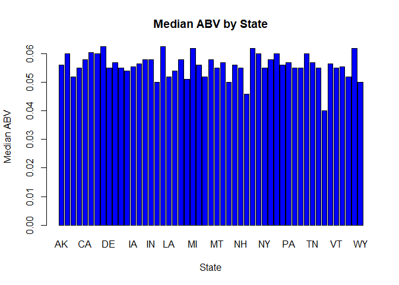

#Introduction
<p>Insert Introduction statement here</p>

<b>Datasets</b>
<p>The following code chunk pulls in two .csv files provided by the client into R. The files are then merged utilizing the Brewery Id as the Primary key. A series of steps to clean the data from abnormalities is performed. Then, column headings and data types for each column are normalized. A sample of the data is shown below.</p>


```r
# load Beers.csv, setting data types
classProfile <- c("character", "integer", "numeric", "integer", "integer", "factor", "numeric")
beers <- read.csv("Beers.csv", colClasses = classProfile, na.strings = "", strip.white = TRUE)
# further specify Name column in beers
names(beers)[names(beers) == "Name"] <- "Beer_Name"

# load Breweries.csv, setting data types
classProfile <- c("integer","character", "character", "factor")
breweries <- read.csv("Breweries.csv", colClasses = classProfile, na.strings = "", strip.white = TRUE)
# further specify Name column in breweries
names(breweries)[names(breweries) == "Name"] <- "Brewery_Name"

master <- merge(beers, breweries, by.x="Brewery_id", by.y="Brew_ID", all=TRUE)
sum(duplicated(master$Beer_ID)) # shows that the merge did not produce duplicates
```

```
## [1] 0
```

```r
# reorder columns
master <- master[c("Beer_ID", "Beer_Name", "ABV", "IBU", "Style", "Ounces", "Brewery_id", "Brewery_Name", "City", "State" )]
# normalize column names
names(master)[names(master) == "Brewery_id"] <- "Brewery_ID"
# sort rows by beer ID
master <- master[order(master$Beer_ID),]

# head and tail of master
head(master, 6)
```

```
##      Beer_ID                Beer_Name   ABV IBU
## 1021       1          Dale's Pale Ale 0.065  65
## 1020       4        Gordon Ale (2009) 0.087  85
## 1019       5                 Old Chub 0.080  35
## 1018       6       GUBNA Imperial IPA 0.099 100
## 1017       7 Mama's Little Yella Pils 0.053  35
## 1016       8  Ten Fidy Imperial Stout 0.099  98
##                               Style Ounces Brewery_ID        Brewery_Name
## 1021        American Pale Ale (APA)     12        167 Oskar Blues Brewery
## 1020 American Double / Imperial IPA     12        167 Oskar Blues Brewery
## 1019                   Scottish Ale     12        167 Oskar Blues Brewery
## 1018 American Double / Imperial IPA     12        167 Oskar Blues Brewery
## 1017                 Czech Pilsener     12        167 Oskar Blues Brewery
## 1016         Russian Imperial Stout     12        167 Oskar Blues Brewery
##          City State
## 1021 Longmont    CO
## 1020 Longmont    CO
## 1019 Longmont    CO
## 1018 Longmont    CO
## 1017 Longmont    CO
## 1016 Longmont    CO
```

```r
tail(master, 6)
```

```
##   Beer_ID     Beer_Name   ABV IBU                               Style
## 6    2687   Parapet ESB 0.056  47 Extra Special / Strong Bitter (ESB)
## 5    2688    Stronghold 0.060  25                     American Porter
## 4    2689       Pumpion 0.060  38                         Pumpkin Ale
## 3    2690    Wall's End 0.048  19                   English Brown Ale
## 2    2691 Maggie's Leap 0.049  26                  Milk / Sweet Stout
## 1    2692  Get Together 0.045  50                        American IPA
##   Ounces Brewery_ID      Brewery_Name        City State
## 6     16          1 NorthGate Brewing Minneapolis    MN
## 5     16          1 NorthGate Brewing Minneapolis    MN
## 4     16          1 NorthGate Brewing Minneapolis    MN
## 3     16          1 NorthGate Brewing Minneapolis    MN
## 2     16          1 NorthGate Brewing Minneapolis    MN
## 1     16          1 NorthGate Brewing Minneapolis    MN
```

# Analysis

1. How many breweries are present in each state?
<br /><b>Number of Breweries by State</b>
<p>The summary table below shows the number of distinct breweries currently producing craft beers in the United States. We can see there is a heavy concentration of craft beer breweries in CO and CA.</p>

```r
unique.master <- master[!duplicated(master$Brewery_ID),]
table(unique.master$State, useNA = "no")
```

```
## 
## AK AL AR AZ CA CO CT DC DE FL GA HI IA ID IL IN KS KY LA MA MD ME MI MN MO 
##  7  3  2 11 39 47  8  1  2 15  7  4  5  5 18 22  3  4  5 23  7  9 32 12  9 
## MS MT NC ND NE NH NJ NM NV NY OH OK OR PA RI SC SD TN TX UT VA VT WA WI WV 
##  2  9 19  1  5  3  3  4  2 16 15  6 29 25  5  4  1  3 28  4 16 10 23 20  1 
## WY 
##  4
```

2. Merge beer data with the breweries data. Print the first 6 observations and the last six observations to check the merged file.
<br /><b>Printed below are the first and last 6 records of the merged dataset. This view allows us to check for abnormalities in the merged data.</b>

```r
# The two tables were already merged in the data cleaning process (see first section above).
head(master, 6)
```

```
##      Beer_ID                Beer_Name   ABV IBU
## 1021       1          Dale's Pale Ale 0.065  65
## 1020       4        Gordon Ale (2009) 0.087  85
## 1019       5                 Old Chub 0.080  35
## 1018       6       GUBNA Imperial IPA 0.099 100
## 1017       7 Mama's Little Yella Pils 0.053  35
## 1016       8  Ten Fidy Imperial Stout 0.099  98
##                               Style Ounces Brewery_ID        Brewery_Name
## 1021        American Pale Ale (APA)     12        167 Oskar Blues Brewery
## 1020 American Double / Imperial IPA     12        167 Oskar Blues Brewery
## 1019                   Scottish Ale     12        167 Oskar Blues Brewery
## 1018 American Double / Imperial IPA     12        167 Oskar Blues Brewery
## 1017                 Czech Pilsener     12        167 Oskar Blues Brewery
## 1016         Russian Imperial Stout     12        167 Oskar Blues Brewery
##          City State
## 1021 Longmont    CO
## 1020 Longmont    CO
## 1019 Longmont    CO
## 1018 Longmont    CO
## 1017 Longmont    CO
## 1016 Longmont    CO
```

```r
tail(master, 6)
```

```
##   Beer_ID     Beer_Name   ABV IBU                               Style
## 6    2687   Parapet ESB 0.056  47 Extra Special / Strong Bitter (ESB)
## 5    2688    Stronghold 0.060  25                     American Porter
## 4    2689       Pumpion 0.060  38                         Pumpkin Ale
## 3    2690    Wall's End 0.048  19                   English Brown Ale
## 2    2691 Maggie's Leap 0.049  26                  Milk / Sweet Stout
## 1    2692  Get Together 0.045  50                        American IPA
##   Ounces Brewery_ID      Brewery_Name        City State
## 6     16          1 NorthGate Brewing Minneapolis    MN
## 5     16          1 NorthGate Brewing Minneapolis    MN
## 4     16          1 NorthGate Brewing Minneapolis    MN
## 3     16          1 NorthGate Brewing Minneapolis    MN
## 2     16          1 NorthGate Brewing Minneapolis    MN
## 1     16          1 NorthGate Brewing Minneapolis    MN
```

3. Report the number of NA's in each column.
<br /><b>Per below, the ABV column has 62, the IBU column has 1005, and the Style column has 5 NAs. All other columns have zero.</b>

```r
sapply(master, function(x) sum(is.na(x)))
```

```
##      Beer_ID    Beer_Name          ABV          IBU        Style 
##            0            0           62         1005            5 
##       Ounces   Brewery_ID Brewery_Name         City        State 
##            0            0            0            0            0
```

4. Compute the median alcohol content and international bitterness unit for each state. Plot a bar chart to compare.
<br /><b>The bar chart with the median ABV and IBU per state is given below.</b>

```r
ibu.med <- aggregate(master$IBU, by = list(master$State), FUN = function(x) median(x, na.rm = TRUE))
names(ibu.med) <- c("State","IBU")
abv.med <- aggregate(master$ABV, by = list(master$State), FUN = function(x) median(x, na.rm = TRUE))
names(abv.med) <- c("State","ABV")

barplot(ibu.med$IBU, names.arg = ibu.med$State, beside = TRUE, main = "Median IBU by State", xlab = "State", ylab = "Median IBU", col = "Blue")
```

<!-- -->

```r
barplot(abv.med$ABV, names.arg = abv.med$State, beside = TRUE, main = "Median ABV by State", xlab = "State", ylab = "Median ABV", col = "Blue")
```

<!-- -->

5. Which state has the maximum alcoholic (ABV) beer? Which state as the most bitter (IBU) beer?
<br /><b>Colorado has the maximum ABV and Oregon has the most bitter beer.</b>

```r
master[which.max(master$ABV),][,10]
```

```
## [1] CO
## 51 Levels: AK AL AR AZ CA CO CT DC DE FL GA HI IA ID IL IN KS KY LA ... WY
```

```r
master[which.max(master$IBU),][,10]
```

```
## [1] OR
## 51 Levels: AK AL AR AZ CA CO CT DC DE FL GA HI IA ID IL IN KS KY LA ... WY
```

6. Summary statistics for the ABV variable.

```r
summary(master$ABV)
```

```
##    Min. 1st Qu.  Median    Mean 3rd Qu.    Max.    NA's 
## 0.00100 0.05000 0.05600 0.05977 0.06700 0.12800      62
```

7. Is there an apparent relationship between the bitterness of the beer and its alcoholic content? Draw a scatter plot.
<br /><b>Per below, there is a positive linear relationship between ABV and IBU.</b>

```r
plot(master$ABV ~ master$IBU, main = "ABV to IBU", ylab = "ABV", xlab = "IBU")
```

<!-- -->
